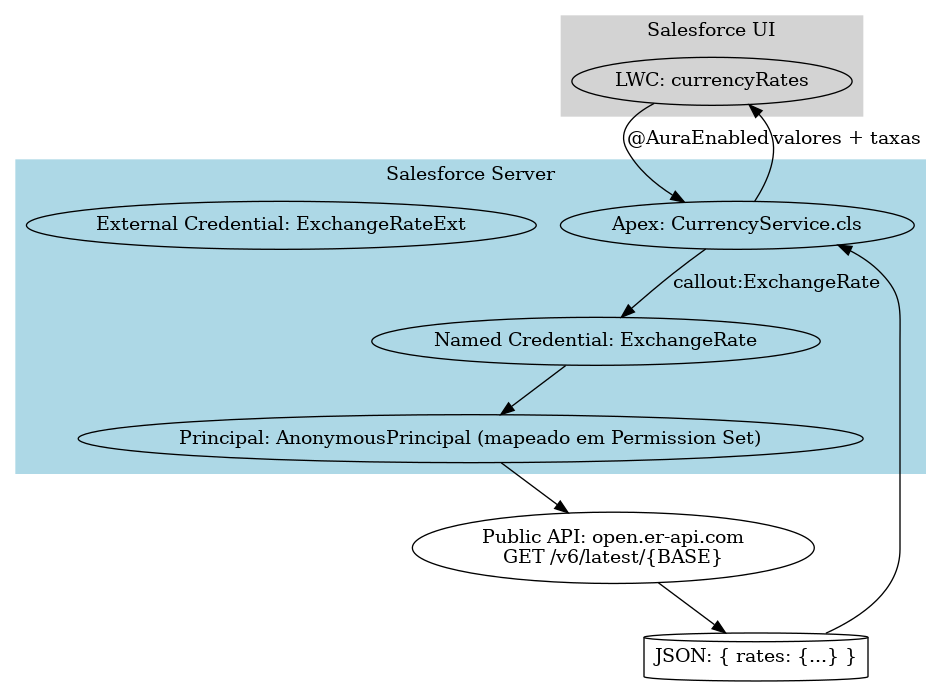

# Currency Integration PoC (Salesforce)

PoC de integração REST em Salesforce com **Named Credential** + **Apex** + **LWC**.  
Consulta taxas de câmbio (API pública [open.er-api.com](https://open.er-api.com)), faz conversões, suporta conversão inversa e formata valores usando a **localização** do usuário Salesforce.

---

## 📸 Exemplo do LWC


---

## 🗺️ Arquitetura



Fluxo simplificado da chamada:
1. LWC (`currencyRates`) chama método Apex.
2. Apex (`CurrencyService.cls`) faz callout via Named Credential.
3. Named Credential → External Credential → Permission Set.
4. API pública retorna JSON com taxas de câmbio.
5. Apex devolve dados para o LWC.
---

## 🔧 Stack

- **Apex** (HttpCallout via Named Credential)
- **LWC** (Lightning Web Components)
- **Named Credential** + **External Credential** (No Authentication)
- **SFDX**

---

## 🚀 Como executar

1. **Criar na org**:
   - **External Credential**: `ExchangeRateExt` (No Authentication)
   - **Principal**: `AnonymousPrincipal` (mapeado em um Permission Set)
   - **Named Credential**: `ExchangeRate` → URL `https://open.er-api.com`

2. **Fazer o deploy**:
   ```bash
   sf project deploy start

3. **Adicionar o LWC currencyRates em uma página do Lightning App Builder.**

4. **Estrutura do projeto**

force-app/main/default/
├── classes
├── lwc/currencyRates
├── externalCredentials
├── namedCredentials
└── ...
📜 **Licença**
Este projeto é apenas uma prova de conceito (PoC) para fins educacionais e não possui garantia de uso em produção.