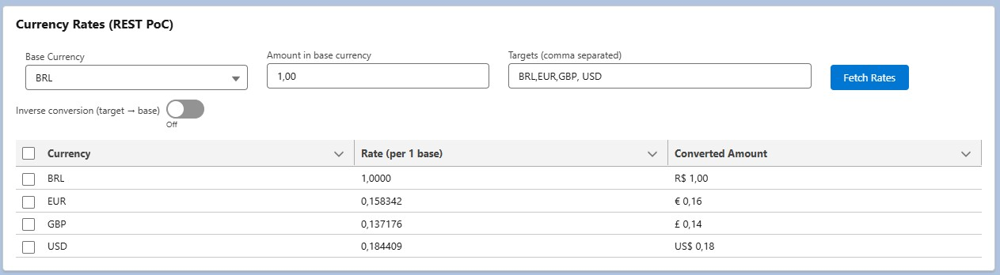

# Currency Integration PoC (Salesforce)

PoC de integração REST em Salesforce com **Named Credential** + **Apex** + **LWC**.  
Consulta taxas de câmbio (API pública [open.er-api.com](https://open.er-api.com)), faz conversões, suporta conversão inversa e formata valores usando a **localização** do usuário Salesforce.

---

## 📸 Exemplo do LWC



---

## 🗺️ Arquitetura (Mermaid)

```mermaid
flowchart TB
    subgraph UI["Salesforce UI"]
        A[LWC - currencyRates]
    end

    subgraph Server["Salesforce Server"]
        B[Apex - CurrencyService.cls]
        C[Named Credential - ExchangeRate]
        D[External Credential - ExchangeRateExt]
        E[Principal - AnonymousPrincipal / Permission Set]
    end

    F[Public API - open.er-api.com /v6/latest/{BASE}]
    G[(JSON com rates)]

    A -- @AuraEnabled --> B
    B -- callout:ExchangeRate --> C
    C --> D --> E
    E --> F
    F --> G --> B
    B -- valores + taxas --> A

```
---

## 🔧 Stack

- **Apex** (HttpCallout via Named Credential)
- **LWC** (Lightning Web Components)
- **Named Credential** + **External Credential** (No Authentication)
- **SFDX**

---

## 🚀 Como executar

1. **Criar na org**:
   - **External Credential**: `ExchangeRateExt` (No Authentication)
   - **Principal**: `AnonymousPrincipal` (mapeado em um Permission Set)
   - **Named Credential**: `ExchangeRate` → URL `https://open.er-api.com`

2. **Fazer o deploy**:
   ```bash
   sf project deploy start

3. **Adicionar o LWC currencyRates em uma página do Lightning App Builder.**

4. **Estrutura do projeto**

force-app/main/default/
├── classes
├── lwc/currencyRates
├── externalCredentials
├── namedCredentials
└── ...
📜 **Licença**
Este projeto é apenas uma prova de conceito (PoC) para fins educacionais e não possui garantia de uso em produção.